# Model Maker Help File Index

### [3D : Virtual 3D](./3dvirtual3d.htm)

### [3D : Grid](./3d___grid.htm)

### [Add - All cad lines](./add_allcadlines.htm)

### [Add - Cad Text](./add_cadtext.htm)

### [Add - Single](./add_single.htm)

### [ANALYSIS](./analysis.htm)

### [ANALYSIS : Polarea](./analysispolarea.htm)

### [ANALYSIS: Ponding](./analysis_ponding.htm)

### [ANALYSIS : Concrete Floor](./analysis__concrete_floor.htm)

### [ANALYSIS : Flood area](./analysis__flood_area.htm)

### [ANALYSIS : Straight Edge](./analysis__straight_edge.htm)

### [ANALYSIS : Height](./analysis___height_.htm)

### [ANALYSIS : Network](./analysis___network.htm)

### [ANALYSIS : Slope](./analysis___slope_.htm)

### [ANALYSIS : Slope Area](./analysis___slope_area_.htm)

### [ANALYSIS : Valley](./analysis___valley_.htm)

### [AREA : Define](./area_define.htm)

### [SURVEY : Area to cad](./area_tocad.htm)

### [Background](./background.htm)

### [CAD : Arc - Fit arc](./cadarc_fitarc.htm)

### [CAD : Blocks](./cadblocks.htm)

### [CAD : Cirlce](./cadcirlce.htm)

### [CAD : Text](./cadcirlce2.htm)

### [CAD : Identify](./cadcirlce7.htm)

### [CAD : Identify - Combination](./cadidentify_combination.htm)

### [CAD : Identify - New](./cadidentify_new.htm)

### [CAD : Identify - On the FLY](./cadidentify_onthefly.htm)

### [CAD : Identify - Re-scale](./cadidentify_re_scale.htm)

### [CAD : Identify - Rotate](./cadidentify_rotate.htm)

### [CAD : Identify - Trim area](./cadidentify_trimarea.htm)

### [CAD : Identify - Write - Distance](./cadidentify_write_dista.htm)

### [Cad : Layer not displayed](./cadlayernotdisplayed.htm)

### [CAD : Line](./cadline.htm)

### [CAD : Line - 2 Line Square](./cadline_2linesquare.htm)

### [CAD : Line - Attributes](./cadline_attributes.htm)

### [CAD : Line - Cut](./cadline_cut.htm)

### [Delete Lines](./cadline_delete.htm)

### [CAD : Line - divide in 2](./cadline_dividein2.htm)

### [CAD : Line - Ellipse](./cadline_ellipse.htm)
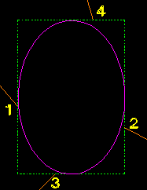

### [CAD : Line - Extend](./cadline_extend.htm)

### [CAD : Line - Info](./cadline_info.htm)

### [CAD : Line - Meet](./cadline_meet.htm)

### [Move Lines](./cadline_move.htm)

### [CAD : Line - Move point](./cadline_movepoint.htm)

### [CAD : Line - Parallel](./cadline_parallel.htm)

### [CAD : Line - Replace](./cadline_replace.htm)

### [CAD : Line - Shape](./cadline_shape.htm)

### [CAD : Line - Special](./cadline_special.htm)

### [CAD : Line - Trim](./cadline_trim.htm)

### [CAD : Pattern](./cadpattern.htm)

### [CAD : Pattern - Auto](./cadpattern_auto.htm)

### [CAD : Pattern - Copy](./cadpattern_copy.htm)

### [CAD : Pattern - Delete](./cadpattern_delete.htm)

### [CAD : Pattern - Dtm](./cadpattern_dtm.htm)

### [CAD : Pattern - Explode](./cadpattern_explode.htm)

### [CAD : Pattern - Info](./cadpattern_info.htm)

### [CAD : Pattern - Load](./cadpattern_load.htm)

### [CAD : Pattern - Move](./cadpattern_move.htm)

### [CAD : Pattern - Optimize](./cadpattern_optimize.htm)

### [CAD : Pattern - Org dtm](./cadpattern_orgdtm.htm)

### [CAD : Pattern - Rename](./cadpattern_rename.htm)

### [CAD : Pattern - Re-scale](./cadpattern_re_scale.htm)

### [CAD : Pattern - Save](./cadpattern_save.htm)

### [CAD : Text - Align](./cadtext_align.htm)

### [CAD : Text - Block](./cadtext_block.htm)

### [CAD : Text - Blockmove](./cadtext_blockmove.htm)

### [CAD : Text - Copy Text](./cadtext_copy.htm)

### [CAD : Text - Delete Text](./cadtext_delete.htm)

### [CAD : Text - Edit Text](./cadtext_edit.htm)

### [CAD : Text - Legend](./cadtext_legend.htm)
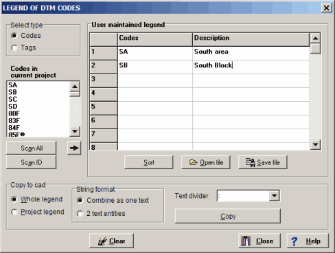

### [CAD : Text - Load block](./cadtext_loadblock.htm)

### [CAD : Text - Load coordinate](./cadtext_loadcoordinate.htm)

### [CAD : Text - Load identified points](./cadtext_loadidentifiedp.htm)

### [CAD : Text - Move Text](./cadtext_move.htm)

### [CAD : Text - Rescale](./cadtext_rescale.htm)

### [CAD : Text - Search & replace](./cadtext_searchreplace.htm)

### [CAD : Track](./cadtrack.htm)

### [CAD : Arc/Circle - Cut](./cad_arccircle_cut.htm)

### [CAD : Arc/Circle Divide](./cad_arccircle_divide.htm)

### [CAD : Arc/Circle - Edit](./cad_arccircle_edit.htm)

### [CAD : Arc/Circle - Fillet](./cad_arccircle_fillet.htm)

### [CAD : Arc/Circle - Info](./cad_arccircle_info.htm)

### [Move, Delete and Copy circles](./cad_arccircle_move.htm)

### [CAD : Arc -Flip](./cad_arc_flip.htm)

### [CAD : Arc - Hemis](./cad_arc_hemis.htm)

### [CAD : Arc - Trim](./cad_arc_rim.htm)

### [CAD : Arrow](./cad_arrow.htm)
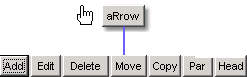

### [CAD : Block](./cad_block.htm)

### [CAD : Identify - Cadline - Point](./cad_cadline_point.htm)

### [CAD : Dimension](./cad_dimension.htm)

### [CAD : Dimension - Notation](./cad_dimension_notation.htm)

### [CAD : Display](./cad_display.htm)

### [CAD : General - User title](./cad_general_user_title.htm)

### [CAD : General - User title - Inverted](./cad_general_user_title_i.htm)

### [CAD : Geo - Areas](./cad_geo_areas.htm)

### [CAD : Hatch](./cad_hatch.htm)

### [CAD : Hatch - Edit Linetype](./cad_hatch_edit_linetype.htm)

### [CAD : Identify - Do id](./cad_identify.htm)

### [CAD : Identify - Active / Passive](./cad_identify_active_pass.htm)

### [CAD : Identify - Area](./cad_identify_area.htm)

### [CAD : Identify - Change](./cad_identify_change.htm)

### [CAD : Identify - Change layer](./cad_identify_change_layer.htm)

### [CAD : Identify - Change pen](./cad_identify_change_pen.htm)

### [CAD : Identify - Copy](./cad_identify_copy.htm)

### [CAD : Identify - Delete](./cad_identify_delete.htm)

### [CAD : Identify - Element](./cad_identify_element.htm)

### [CAD : Identify - Include/Exclude](./cad_identify_includeexclu.htm)

### [CAD : Identify - Match](./cad_identify_match.htm)

### [CAD : Identify - Mirror](./cad_identify_mirror.htm)

### [CAD : Identify - Move](./cad_identify_move.htm)

### [CAD : Callout](./cad__callout.htm)

### [CAD : General - User title - Manage](./cad__general___user_title___ma.htm)

### [CAD : HATCH - Report](./cad__hatch___report.htm)

### [CAD : Line - Polyline](./cad__line___polyline.htm)

### [CAD : Text - ediT+](./cad__text___edit_.htm)

### [CAD : Text - line Inc](./cad__text___line_inc.htm)
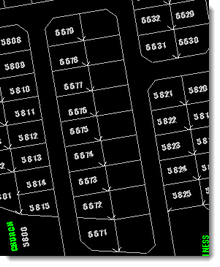

### [CAD : Text - Quick Search & zoom](./cad__text___quick_search__zoom.htm)

### [CAD : Text - rtF](./cad__text___rtf.htm)

### [CAD : Text - sUm text](./cad__text___sum_text.htm)

### [Add Arcs and Circles](./cad___arc_circle_add_.htm)

### [CAD : Arrow - Add node](./cad___arrow___add_node_.htm)
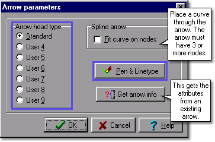

### [CAD : Arrow - Copy](./cad___arrow___copy.htm)

### [CAD : Arrow - Delete](./cad___arrow___delete.htm)

### [CAD : Arrow - Edit](./cad___arrow___edit.htm)

### [CAD : Arrow - Head](./cad___arrow___head.htm)

### [CAD : Arrow - Move](./cad___arrow___move.htm)

### [CAD : Arrow - Parameter](./cad___arrow___parameter.htm)

### [CAD : Images](./cad___bitmap.htm)

### [CAD : Dimension - Add](./cad___dimension___add.htm)

### [CAD : Dimension - Default](./cad___dimension___default.htm)

### [CAD : Dimension - Delete](./cad___dimension___delete.htm)

### [CAD : Dimension - Edit](./cad___dimension___edit.htm)
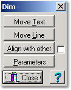

### [CAD : Dimension - Explode](./cad___dimension___explode.htm)

### [CAD : Dimension - Line text](./cad___dimension___line_text_.htm)

### [CAD : Dimension - Rescale_leader](./cad___dimension___rescale_lead.htm)

### [CAD : Dimension - Rescale_text](./cad___dimension___rescale_text.htm)

### [CAD : File - Save identified](./cad___file___save_identified.htm)

### [CAD : General](./cad___general.htm)
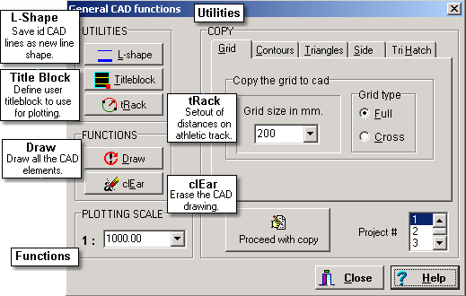

### [CAD : Global](./cad___global.htm)

### [CAD : Hatch - Add](./cad___hatch___add_.htm)

### [CAD : Hatch - Add island](./cad___hatch___add_island_.htm)

### [CAD : Hatch - Delete](./cad___hatch___delete_.htm)

### [CAD : Hatch - Edit Node](./cad___hatch___edit_node_.htm)

### [CAD : Hatch - Explode](./cad___hatch___explode.htm)

### [CAD : Hatch - Move](./cad___hatch___move_.htm)

### [CAD : Hatch - Par](./cad___hatch___par.htm)

### [CAD : Identify - All](./cad___identify___all_.htm)

### [CAD : Identify - Cut out](./cad___identify___cut_out.htm)

### [CAD : Identify - Global](./cad___identify___global.htm)

### [CAD : Identify - Invert](./cad___identify___invert_.htm)

### [CAD : Identify - Layers](./cad___identify___layers.htm)

### [CAD : Identify - Manipulate](./cad___identify___manipulate.htm)

### [CAD : Identify - Report](./cad___identify___report.htm)

### [CAD : Line - 2 circles](./cad___line___2_circles_.htm)

### [Add Lines](./cad___line___add_.htm)

### [CAD : Line - Bend-arc](./cad___line___bend_arc.htm)

### [CAD : Line - Blockmove](./cad___line___blockmove_.htm)

### [CAD : Line - Chamfer](./cad___line___chamfer_.htm)

### [CAD : Line - Divide in segments](./cad___line___divide_in_segment.htm)

### [CAD : Line - Embankment](./cad___line___embankment.htm)

### [CAD : Line - Fillet](./cad___line___fillet_.htm)

### [CAD : Line - Spline](./cad___line___spline.htm)

### [Add Text](./cad___text_add.htm)

### [COPY TO CAD](./copy_to_cad.htm)

### [Co-ords editing: Delete](./co_ordseditingdelete.htm)

### [co-ords editing : General](./co_ordseditinggeneral.htm)

### [co-ords edit : points](./co_ordseditpoints.htm)

### [co-ords edit : points](./co_ordseditpoints1.htm)

### [POINT : Identify](./co_ords_editing___identify_poi.htm)

### [CURSOR : Mode Indicator](./cursormodeindicator.htm)
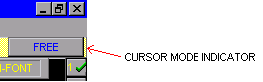

### [CURSOR - Positioning modes](./cursor_positioningmodes.htm)

### [DATA BASE : Audit](./databaseaudit.htm)

### [DATA BASE : Constant](./databaseconstant.htm)

### [DATA BASE : Constanta](./databaseconstanta.htm)

### [DATA BASE : Delete points](./databasedeletepoints.htm)

### [DATA BASE : General](./databasegeneral.htm)

### [DATA BASE : Generala](./databasegenerala.htm)

### [Data base : Line](./databaseline.htm)

### [DATA BASE : New](./databasenew.htm)

### [DATA BASE : Points](./databasepoints.htm)

### [DATA BASE : Points - popup](./databasepoints_popup.htm)

### [Data base : Shape](./databaseshape.htm)

### [DATA TYPES : CAD](./datatypescad.htm)

### [DATA TYPES : DTM](./datatypesdtm.htm)

### [DATA](./data_base.htm)

### [Db - DATA BASE](./db___data_base.htm)

### [DEFINITION : Active menu](./definitionactivemenu.htm)

### [DEFINITION : Attributes](./definitionattributes.htm)

### [DEFINITION : Bitmap](./definitionbitmap.htm)

### [DEFINITION : Button select](./definitionbuttonselect.htm)

### [DEFINITION : Checkbox](./definitioncheckbox.htm)

### [DEFINITION : Code & Tag](./definitioncodetag.htm)

### [DEFINITION : DTM](./definitiondtm.htm)

### [DEFINITION : Edit box - Drop down](./definitioneditbox_dropd.htm)

### [Definitions](./definitionindex.htm)

### [DEFINITION : KOORD](./definitionkoord.htm)

### [DEFINITION : Open side triangle](./definitionopensidetriangl.htm)

### [DEFINITION : Radio Button](./definitionradiobutton.htm)

### [DEFINITION : Speed button](./definitionspeedbutton.htm)

### [DEFINITION : Status](./definitionstatus.htm)

### [DEFINITION : System data](./definitionsystemdata.htm)

### [DEFINITION : Tachy](./definitiontachy.htm)

### [DEFINITION : Triangles](./definitiontriangles.htm)

### [Modules](./definition___modules.htm)

### [Delete Polylines](./deletepolylines.htm)

### [Dongle & Setup files](./dongle_setup.htm)

### [DTM : Point - Delete (Data base)](./dtmpoint_delete(databas.htm)

### [DTM : Point - Delete (Graphically).](./dtmpoint_delete(graphica.htm)

### [DXF OUT](./dxfout.htm)

### [elevation from DTM](./elevationfromdtm.htm)

### [elevation from model](./elevationfrommodel.htm)

### [EXAMPLE : Colors - cad & plotter](./examplecolors_cadplott.htm)

### [EXAMPLE : Coordinate Editing](./examplecoordinateediting.htm)

### [EXAMPLE : DTM functions](./exampledtmfunctions.htm)

### [EXAMPLE : Getting started](./examplegettingstarted.htm)

### [EXAMPLE : Memory Issues](./examplememoryissues.htm)

### [EXAMPLE : Mine ramp rehabilitation](./examplemineramprehabiramp.htm)

### [EXAMPLE : Mine dump rehabilitation](./exampleminerehabdump.htm)

### [Example of Csv format](./exampleofcsvformat.htm)

### [Example of Multisurve](./exampleofmultisurve.htm)

### [EXAMPLE : Projects](./exampleprojects.htm)

### [EXAMPLE : Station correction angle](./examplestationcorrectiona.htm)

### [EXAMPLE : The total picture](./examplethetotalpicture.htm)

### [EXAMPLE : Title blocks](./exampletitleblocks.htm)

### [Example of XML formats](./example_of_xml_formats.htm)

### [How to create a DTM](./example___working_example_1.htm)

### [EXAMPLE : Entering Survey Data](./example___working_example_2.htm)

### [How to create a horizontal alignment](./example___working_example_3.htm)
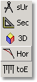

### [How to create a 3D model](./example___working_example_4.htm)
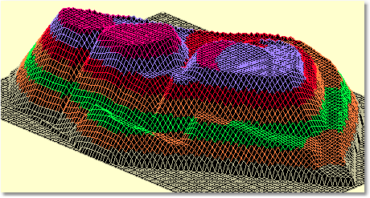

### [How to determine toe points for a terrace model](./example___working_example_5.htm)

### [How to calculate cut & fill volume](./example___working_example_6.htm)

### [How to plot](./example___working_example_7.htm)

### [How to create/edit line styles](./example___working_example_8.htm)

### [FILE](./file.htm)

### [FILE : Export All](./fileexportall.htm)

### [FILE : Export data - Stardust](./fileexportdata_stardust.htm)

### [FILE : Find](./filefind.htm)

### [FILE : Import - Define](./fileimport_define.htm)

### [FILE : Import - Moss](./fileimport_moss.htm)

### [FILE : Import - Stereo](./fileimport_stereo.htm)

### [FILE : Load ASCII](./fileloadascii.htm)

### [FILE : Load - Add/Replace](./fileload_addreplace.htm)

### [FILE : Save - Ascii](./filesave_ascii.htm)

### [FILE : Save - Binary Coordinate](./filesave_binarycoordinat.htm)

### [FILE : Editor](./files___editor.htm)

### [FILE : Total](./filetotal.htm)

### [FILE : Import - Dem file](./file__import___dem_file.htm)

### [FILE : Import - DWG](./file__import___dxf.htm)

### [FILE : Backup](./file___backup.htm)

### [FILE : Exit](./file___exit.htm)

### [FILE : Export data - Define](./file___export_data___define_.htm)

### [FILE : Import - DXF](./file___import___dxf_.htm)

### [FILE : New](./file___new.htm)

### [FILE : Open / Save Menu](./file___open___save_menu.htm)

### [General menu](./generalmenu.htm)

### [General menu 2](./generalmenu2.htm)

### [Printer](./generalprinter.htm)

### [Paper - Size](./general___paper___size_.htm)

### [GEO : Add](./geoadd.htm)

### [GEO : Clear](./geoclear.htm)

### [GEO : Consistency](./geoconsistency.htm)

### [GEO : Copy](./geocopy.htm)

### [GEO : Delete](./geodelete.htm)

### [GEO : Edit](./geoedit.htm)

### [GEO : Identify](./geoidentify.htm)

### [GEO : Information](./geoinformation.htm)

### [GEO : Move](./geomove.htm)

### [GEO : Rotate](./georotate.htm)

### [GEO : Sort](./geosort.htm)

### [Getting Started](./getting_started.htm)

### [OUTPUT : Google Earth](./googleearth.htm)

### [Google Earth - Elevations Example](./googleearth_elevations.htm)

### [Google Earth - KML](./googleearth_kml.htm)

### [Help on general function](./helpongeneralfunction.htm)

### [HORIZONTAL : Centre line file](./horizontalcenterline.htm)
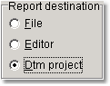

### [HORIZONTAL : Curve data](./horizontalcurvedata.htm)

### [HORIZONTAL](./horizontalmenu.htm)

### [HORIZONTAL : Print](./horizontalprint.htm)

### [HORIZONTAL : Setout](./horizontalsetout.htm)

### [HORIZONTAL : Chainages](./horizontal___chainages.htm)

### [HORIZONTAL : Copy to cad](./horizontal___copy_to_cad.htm)

### [HORIZONTAL : Edit PI](./horizontal___edit_pi.htm)

### [HORIZONTAL : Load](./horizontal___load_.htm)

### [HORIZONTAL : New](./horizontal___new.htm)

### [HORIZONTAL : Plot](./horizontal___plot.htm)

### [HORIZONTAL : Save](./horizontal___save_.htm)

### [HORIZONTAL : Textedit](./horizontal___textedit.htm)

### [HORIZONTAL : Vehicle turn](./horizontal___vehicle_turn.htm)

### [HORIZONTAL : Zoom, File, Report](./horizontal___zoom__file__repor.htm)

### [How to compare 2 projects](./howtocompare2projects.htm)

### [popup cad gen](./ind4qzqdi.htm)

### [INPUT COORDINATES : Electronic field book-](./inputcoordinateselectronic.htm)

### [INPUT COORDINATES : Electronic field book](./inputcoordinateselectronicfiel.htm)

### [INPUT COORDINATES : From files](./inputcoordinatesfromfiles.htm)

### [INPUT COORDINATES : Manual entry](./inputcoordinatesmanualent.htm)

### [Introduction](./introduction.htm)

### [IRRIGATION](./irrigation.htm)

### [IRRIGATION : Block RTF Info](./irrigationblockrtfinfo.htm)

### [IRRIGATION : Auto Blocks - Auto divide](./irrigationblocks_auto.htm)

### [IRRIGATION : Blocks - Editting](./irrigationblocks_editting.htm)

### [IRRIGATION : Blocks - Layout](./irrigationblocks_layout.htm)

### [IRRIGATION : Blocks - Precipitation](./irrigationblocks_precipit.htm)

### [IRRIGATION : Block - Report](./irrigationblock_report.htm)

### [IRRIGATION : Calculator](./irrigationcalculator.htm)

### [IRRIGATION : Clearance](./irrigationclearance.htm)

### [IRRIGATION : Pivot - Clearance_2](./irrigationclearance_2.htm)

### [IRRIGATION : Default & Check](./irrigationdefaultcheck.htm)

### [IRRIGATION : Dual Pumps](./irrigationdualpumps.htm)

### [IRRIGATION : Example](./irrigationexample.htm)

### [IRRIGATION : Step by step - Solid set](./irrigationexamplestepsoli.htm)
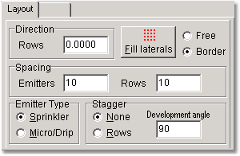

### [IRRIGATION : Example - Step by step](./irrigationexample_stepby.htm)

### [IRRIGATION : Flushing Manifolds](./irrigationflushingmanifold.htm)

### [IRRIGATION : Global Reports](./irrigationglobalreports.htm)

### [IRRIGATION : Hydraulics - Water Hammer](./irrigationglobalreports_2.htm)

### [IRRIGATION : Global - Multiple nodes](./irrigationglobal_multiple.htm)

### [IRRIGATION : Hydraulics](./irrigationhydraulics.htm)

### [IRRIGATION : Hydraulics - Info](./irrigationhydraulics_info.htm)

### [IRRIGATION : Hydraulics - Long Section](./irrigationhydraulics_long.htm)

### [IRRIGATION : Hydraulics - Size Pipes2](./irrigationhydraulics_siz2.htm)

### [IRRIGATION : Hydraulics - Size Pipes](./irrigationhydraulics_size.htm)

### [IRRIGATION : Hydraulics - Total Head Calc](./irrigationhydraulics_tot.htm)
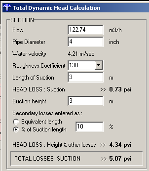

### [IRRIGATION : Node Data base](./irrigationnodedatabase.htm)

### [IRRIGATION : Node Data base k](./irrigationnodedatabasek.htm)

### [IRRIGATION : Nodes - Info](./irrigationnodes_info.htm)

### [IRRIGATION : Nodes - New](./irrigationnodes_new.htm)

### [IRRIGATION : Nodes - Saving Calc](./irrigationnodes_savingca.htm)

### [IRRIGATION : Parts - Data base](./irrigationparts_database.htm)

### [IRRIGATION : Parts - Node Display](./irrigationparts_nodedisp.htm)

### [IRRIGATION : Parts - Template](./irrigationparts_template.htm)

### [IRRIGATION : Parts - Template -](./irrigationparts_template1.htm)

### [IRRIGATION : Pipe Data base](./irrigationpipedatabase.htm)

### [Irrigation : Pipes - Length](./irrigationpipeslength.htm)

### [IRRIGATION : Pipes - DBF](./irrigationpipes_dbf.htm)

### [IRRIGATION : Pipes - Info](./irrigationpipes_info.htm)

### [IRRIGATION : Pipes - New](./irrigationpipes_new.htm)

### [IRRIGATION : Proposed pump pressure](./irrigationproposedpumppre.htm)

### [IRRIGATION : Shapes](./irrigationshapes.htm)

### [IRRIGATION : Shifts - Auto](./irrigationshifts_auto.htm)

### [IRRIGATION : Shifts - Graphicspop](./irrigationshifts_graphicp.htm)

### [IRRIGATION : Shifts - Graphics](./irrigationshifts_graphics_2.htm)

### [IRRIGATION TURF](./irrigationtruf.htm)

### [IRRIGATION: Blocks - Edit Emitter or Pipe](./irrigation_blocks___edit_emitt.htm)

### [IRRIGATION - Project](./irrigation_project.htm)

### [IRRIGATION - Projects](./irrigation_projects.htm)

### [IRRIGATION : Air valves](./irrigation__air_valves.htm)

### [IRRIGATION : Auto blocks - Fixed](./irrigation__automatic_blocks.htm)

### [IRRIGATION : Auto blocks](./irrigation__auto_blocks.htm)

### [IRRIGATION : Auto blocks - Cadlines](./irrigation__auto_blocks___cadl.htm)

### [IRRIGATION : Blocks - TramLines](./irrigation__blocks___tramlines.htm)

### [IRRIGATION : Drip](./irrigation__drip.htm)
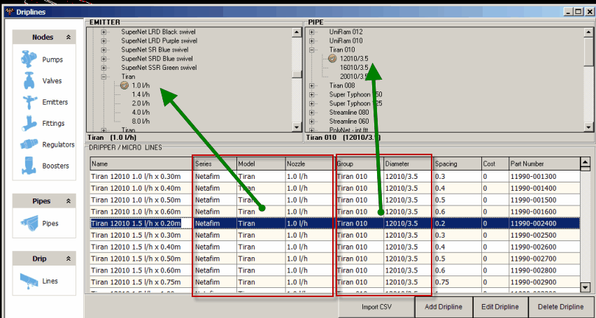

### [IRRIGATION : Import csv data](./irrigation__import_csv_data.htm)
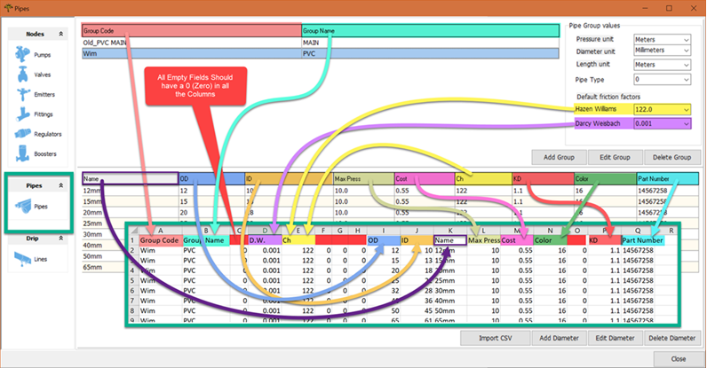

### [IRRIGATION : Import csv data](./irrigation__import_csv_data2.htm)

### [IRRIGATION : Moveable System](./irrigation__moveable_system.htm)

### [IRRIGATION : Pivot - Pivot Parameters](./irrigation__operation.htm)

### [IRRIGATION : Parts - Pipe Rolls](./irrigation__parts___pipe_rolls.htm)

### [IRRIGATION : Pivot - Pivot Defaults](./irrigation__pivot_defaults.htm)

### [IRRIGATION : Pivot - Pivot Help](./irrigation__pivot_help.htm)

### [IRRIGATION : Pivot - Pivot Hydraulics](./irrigation__pivot_hydraulics.htm)

### [IRRIGATION : Pivot - Pivot Operation](./irrigation__pivot_operation.htm)

### [IRRIGATION : Pivot - Pivot Pressure and Flow](./irrigation__pivot_pressure_and.htm)

### [IRRIGATION : Pivot - Section](./irrigation__pivot___section.htm)

### [IRRIGATION : Pumps](./irrigation__pumps.htm)

### [IRRIGATION : VSB - Simulations](./irrigation__vsb___simulations.htm)

### [IRRIGATION : VSD (Variable pressure)](./irrigation__vsd_variable_press.htm)

### [IRRIGATION : Blocks](./irrigation___blocks.htm)

### [IRRIGATION : Cad](./irrigation___cad.htm)

### [IRRIGATION : Defaults](./irrigation___defaults.htm)

### [IRRIGATION : Global](./irrigation___global.htm)

### [IRRIGATION : Nodes](./irrigation___nodes.htm)

### [IRRIGATION : Parts](./irrigation___parts.htm)

### [IRRIGATION : Pipes](./irrigation___pipes.htm)

### [IRRIGATION : Pivot](./irrigation___pivot.htm)

### [Irrigation - Plot button](./irrigation___plot_button.htm)

### [IRRIGATION - Roll back](./irrigation___roll_back.htm)

### [IRRIGATION : Shifts](./irrigation___shifts.htm)

### [popup cad global](./jexo1v.htm)

### [Keyplan](./keyplan.htm)

### [License agreement](./licenseagreement.htm)

### [LIMITS - Dialog box](./limits_dialogbox.htm)

### [Line and Text Styles](./lineandtextstyles.htm)

### [Load Desktop](./loaddesktop.htm)

### [LOGIC WHEN SELECTING LINES](./logicwhenselectinglines.htm)
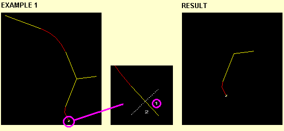

### [CAD](./main_cad.htm)

### [MENU : Mining](./main_mining.htm)

### [Main Screen Layout](./main_screen.htm)

### [MENU : Sections](./main_sections.htm)

### [MEASURE : Menu](./measuremenu.htm)

### [Menus - Toolbars](./menu.htm)

### [MENU : 3D](./menu3d.htm)

### [MENU : Bottom](./menubottom.htm)

### [MENU : Left](./menuleft.htm)

### [MENU : Paper](./menupaper.htm)

### [Paper - Viewport](./menupaper_viewport.htm)

### [MENU : Right](./menuright.htm)

### [MENU : Right - DTM Display](./menuright_dtmdisplay.htm)

### [MENU : Top](./menutop_2.htm)

### [SETTINGS : Customize Toolbar](./menutop_customizetoolbar.htm)

### [SETTINGS : Wizard](./menutop_wizard.htm)

### [MENU : Cad : Text - Load](./menu__cad__text___load.htm)

### [PAPER](./menu___general.htm)

### [MENU : Horizontal](./menu___horizontal.htm)

### [MENU : Point](./menu___point.htm)

### [MENU : Pro](./menu___pro_.htm)

### [MENU : Survey](./menu___survey.htm)

### [MENU : Terrace](./menu___terrace.htm)

### [MENU : Triangles](./menu___triangles_.htm)

### [MENU : Volumes](./menu___volumes.htm)

### [MINE : Borehole manager](./mineboreholemanager.htm)

### [MINE : Geo Average](./minegeoaverage.htm)

### [MINE : Load](./mineload.htm)

### [MINE : Move volume](./minemovevolume.htm)

### [MINE : Rehab - Id String](./minerehab_idstring.htm)

### [MINE : Rehab - One String & Slope](./minerehab_string1.htm)

### [MINE : Rehab - String2](./minerehab_string2.htm)

### [MINE : Sections](./minesections.htm)

### [MINE : Setup projects](./minesetupprojects.htm)

### [MINE : Strip width](./minestripwidth.htm)

### [MINE : Update Surface](./mineupdatesurface.htm)

### [Mine Layer Depth](./mine_layer_depth.htm)

### [MINE : Blast Grid](./mine__blast_grid.htm)

### [MINE : CSV List](./mine__csv_list.htm)

### [MINE : Rehab - Average elevation](./mine__rehab___average_elevatio.htm)

### [MINE : Optimize](./mine___optimize.htm)

### [MINE : Planning](./mine___planning_.htm)

### [MINE : Rehabilitation](./mine___rehabilitation.htm)

### [MINE : Volume](./mine___volume.htm)

### [MINE : Volume Centroids](./mine___volume_centroids.htm)

### [GNSS Machine Guidance](./module_22.htm)
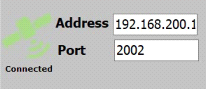

### [SURVEY](./newitem.htm)

### [MENU : Analysis](./newitem10.htm)

### [MENU : Toepoint](./newitem11.htm)

### [SECTIONS](./newitem12.htm)

### [PROJECT](./newitem13.htm)

### [Data base : Gen](./newitem14.htm)

### [MINING](./newitem2.htm)

### [TERRACE : Volumes](./newitem20.htm)

### [POINTS](./newitem3.htm)

### [3D](./newitem4.htm)

### [TRIANGLES](./newitem6.htm)

### [VOLUME](./newitem7.htm)

### [MENU : Cad](./newitem8.htm)

### [MENU : Irrigation](./newitem9.htm)

### [Optimize-Solar](./optimize_solar.htm)

### [OUTPUT](./output.htm)

### [OUTPUT : Plotter detail](./outputplotterdetail.htm)

### [OUTPUT : Caddie](./output___caddie.htm)

### [OUTPUT : DXF](./output___dxf_.htm)

### [OUTPUT : GENESIS](./output___genesis_.htm)

### [OUTPUT : HGPL/Printer](./output___hgpl_printer.htm)

### [OUTPUT : MOSS - Contours](./output___moss___contours_.htm)

### [OUTPUT : Standard plotter](./output___standard_plotter.htm)

### [OUTPUT : ASCII](./output____ascii_.htm)

### [Overview](./overviewandquickstart.htm)

### [PEN : Attributes](./penattributes.htm)

### [Photo Viewer](./photo_viewer.htm)

### [IRRIGATION : Pipe Lengths](./pipelengths.htm)

### [Pivot : Manufacturers](./pivot__manufacturers.htm)

### [Pivot : Spans](./pivot__spans.htm)

### [PLOT : Manipulate & settings](./plotmanipulate.htm)

### [PLOT : Parameters - Sizes](./plotparameters_sizes.htm)

### [PLOT : Parameters](./plot___parameters.htm)

### [Add - Points](./pnt_add.htm)

### [Delete Points](./pnt_del.htm)

### [Moving a point](./pnt_move.htm)

### [Edit and get info of a point](./pnt_point.htm)

### [Add - Attributes](./pointadd_attributes.htm)

### [Add - Cad line](./pointadd_cadline.htm)

### [Add - Circle](./pointadd_circle.htm)

### [Add - Polyline](./pointadd_polyline.htm)

### [POINT : Code indicate](./pointcodeindicate.htm)

### [POINT : Identify - Change Elevation](./pointidentify_changeelev.htm)

### [POINT : Identify - Change - Code](./pointidentify_change_co.htm)

### [POINT : Identify - Copy](./pointidentify_copy.htm)

### [POINT : Identify - Copy to cad](./pointidentify_copytocad.htm)

### [POINT : Identify - Cut or fill](./pointidentify_cutorfill.htm)

### [POINT : Identify - Duplicate](./pointidentify_duplicate.htm)

### [POINT : Identify - Interpolate](./pointidentify_interpolate.htm)

### [POINT : Identify - Match](./pointidentify_match.htm)

### [POINT : Identify - Print id report](./pointidentify_printidre.htm)

### [POINT : Identify - Rotate](./pointidentify_rotate.htm)

### [POINT : Identify - Stretch](./pointidentify_stretch.htm)

### [POINT : Increment code](./pointincrementcode.htm)

### [POINT : Identify methods](./point_identify_methods.htm)

### [POINT : Special](./point__special.htm)

### [POINT : Special - Move by triangle](./point__special___move_by_trian.htm)

### [POINT : Special - Renumber](./point__special___renumber.htm)

### [POINT : Special - Upcode](./point__special___upcode.htm)

### [POINT : Circle at slope](./point___circle_at_slope_.htm)

### [Jump to a point with a certain code](./point___code_select.htm)

### [POINT : Extract detail](./point___extract_detail.htm)

### [POINT : Height](./point___height_.htm)

### [POINT : Identify - Invert](./point___identify___invert.htm)

### [POINT : Identify - Manipulate](./point___identify___move.htm)

### [POINT : Identify - New](./point___identify___new_.htm)

### [POINT : Identify - Show](./point___identify___show_.htm)

### [Jump to a numbered Point](./point___jump_to_number_.htm)

### [POINT : Move by triangle](./point___move_by_triangle.htm)

### [POINT : Plot](./point___plot.htm)

### [POINT : Renumber](./point___renumber.htm)

### [POINT : Station to points.](./point___station_to_points__.htm)

### [POINT : Upcode](./point___upcode.htm)

### [popup 3d gridDtm](./popup3dgriddtm.htm)

### [popup 3d quick](./popup3dquick.htm)

### [popup 3d view](./popup3dview.htm)

### [popup ana height](./popupanaheight.htm)

### [popup ana network](./popupananetwork.htm)

### [popup ana sarea](./popupanasarea.htm)

### [popup ana slope](./popupanaslope.htm)

### [popup ana valley](./popupanavalley.htm)

### [popup cad arc flip](./popupcadarcflip.htm)

### [popup cad areas](./popupcadareas.htm)

### [popup cad arrow](./popupcadarrow.htm)

### [popup cad arrow add](./popupcadarrowadd.htm)

### [popup cad arrow copy](./popupcadarrowcopy.htm)

### [popup cad arrow del](./popupcadarrowdel.htm)

### [popup cad arrow edit](./popupcadarrowedit.htm)

### [popup cad arrow head](./popupcadarrowhead.htm)
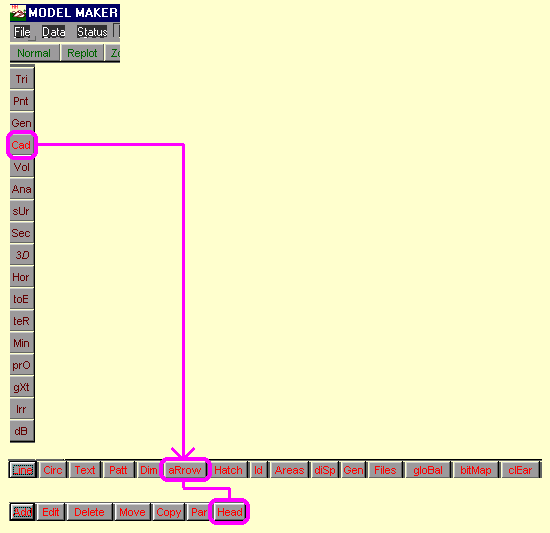

### [popup cad arrow move](./popupcadarrowmove.htm)

### [popup cad arrow par](./popupcadarrowpar.htm)

### [popup cad bitmap](./popupcadbitmap.htm)

### [popup cad circ addcirc](./popupcadcircaddcirc.htm)

### [popup cad circ cut](./popupcadcirccut.htm)
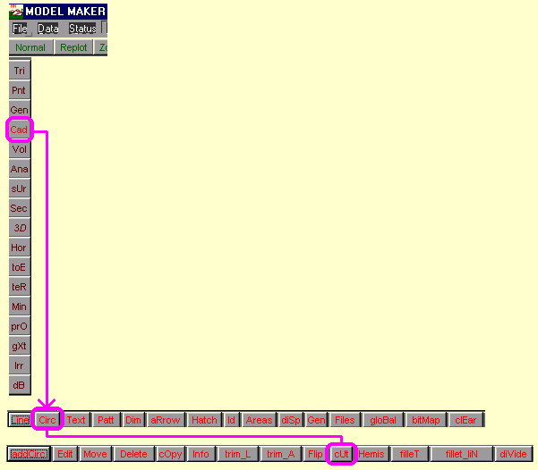

### [popup cad circ div](./popupcadcircdiv.htm)

### [popup cad circ edit](./popupcadcircedit.htm)

### [popup cad circ fillet](./popupcadcircfillet.htm)

### [popup cad circ hemis](./popupcadcirchemis.htm)

### [popup cad circ info](./popupcadcircinfo.htm)

### [popup cad circ move](./popupcadcircmove.htm)

### [popup cad circ trimL](./popupcadcirctriml.htm)

### [popup cad dim](./popupcaddim.htm)

### [popup cad dim add](./popupcaddimadd.htm)

### [popup cad dim def](./popupcaddimdef.htm)
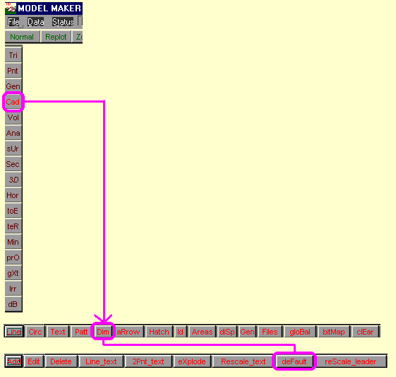

### [popup cad dim del](./popupcaddimdel.htm)

### [popup cad dim edit](./popupcaddimedit.htm)

### [popup cad dim expl](./popupcaddimexpl.htm)

### [popup cad dim rescale L](./popupcaddimrescalel.htm)

### [popup cad dim rescale T](./popupcaddimrescalet.htm)

### [popup cad disp](./popupcaddisp.htm)

### [popup cad files saveid](./popupcadfilessaveid.htm)

### [popup cad hatch del](./popupcadhatchdel.htm)

### [popup cad hatch edit](./popupcadhatchedit.htm)

### [popup cad hatch exp](./popupcadhatchexp.htm)

### [popup cad hatch island](./popupcadhatchisland.htm)

### [popup cad hatch move](./popupcadhatchmove.htm)

### [popup cad hatch par](./popupcadhatchpar.htm)

### [popup cad id cutout](./popupcadidcutout.htm)

### [popup cad id doId area](./popupcadiddoidarea.htm)

### [popup cad id doId Qall](./popupcadiddoidqall.htm)
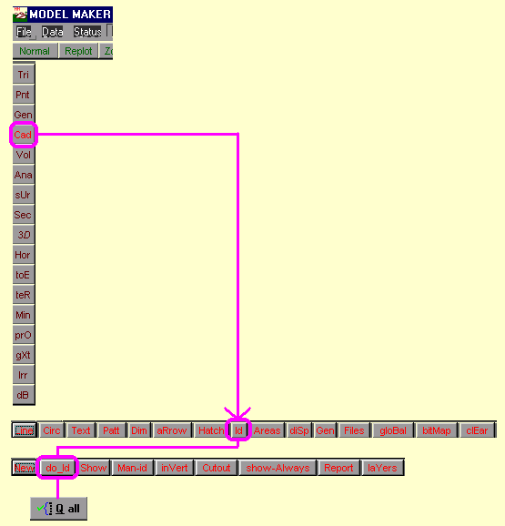

### [popup cad identify](./popupcadidentify.htm)

### [popup cad id global](./popupcadidglobal.htm)

### [popup cad id invert](./popupcadidinvert.htm)

### [popup cad id layers](./popupcadidlayers.htm)

### [popup cad id manid](./popupcadidmanid.htm)

### [popup cad id manid change](./popupcadidmanidchange.htm)

### [popup cad id manid change lay](./popupcadidmanidchangelay.htm)

### [popup cad id manid change pen](./popupcadidmanidchangepen.htm)

### [popup cad id manid copy](./popupcadidmanidcopy.htm)

### [popup cad id manid del](./popupcadidmaniddel.htm)

### [popup cad id manid match](./popupcadidmanidmatch.htm)

### [popup cad id manid mirror](./popupcadidmanidmirror.htm)

### [popup cad id manid move](./popupcadidmanidmove.htm)

### [popup cad id manid rotate](./popupcadidmanidrotate.htm)

### [popup cad id manid scale](./popupcadidmanidscale.htm)

### [popup cad id manid trim area](./popupcadidmanidtrimarea.htm)

### [popup cad id new](./popupcadidnew.htm)

### [popup cad id report](./popupcadidreport.htm)

### [popup cad line add](./popupcadlineadd.htm)

### [popup cad line cut](./popupcadlinecut.htm)

### [popup cad line delete](./popupcadlinedelete.htm)

### [popup cad line div2](./popupcadlinediv2.htm)

### [popup cad line edit](./popupcadlineedit.htm)

### [popup cad line extnd](./popupcadlineextnd.htm)

### [popup cad line info](./popupcadlineinfo.htm)

### [popup cad line meet](./popupcadlinemeet.htm)

### [popup cad line move](./popupcadlinemove.htm)

### [popup cad line movep](./popupcadlinemovep.htm)

### [popup cad line spec blockmove](./popupcadlinespecblockmove.htm)

### [popup cad line spec chamfer](./popupcadlinespecchamfer.htm)
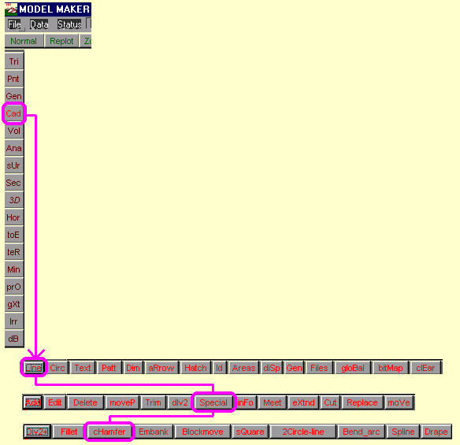

### [popup cad line spec div2+](./popupcadlinespecdiv2.htm)

### [popup cad line spec embank](./popupcadlinespecembank.htm)

### [popup cad line spec fillet](./popupcadlinespecfillet.htm)

### [popup cad line spec square](./popupcadlinespecsquare.htm)

### [popup database cons](./popupdatabasecons.htm)

### [popup hor new](./popuphornew.htm)

### [popup parameters](./popupparameters.htm)

### [popup pnt duplicate](./popuppntduplicate.htm)

### [popup sec X / L](./popupsecxl.htm)

### [Popup ter cut-fill](./popuptercut_fill.htm)

### [popup vol areacon](./popupvolareacon.htm)

### [popup vol areacon](./popupvolareacon1.htm)

### [popup vol average](./popupvolaverage.htm)

### [popup vol contours](./popupvolcontours.htm)

### [popup cad line spec bendarc](./popup_cadline_spec_bendarc.htm)

### [popup cad hatch](./popup_cad_hatch.htm)
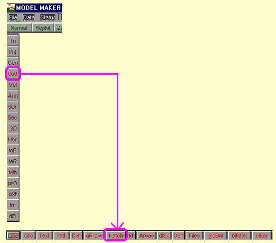

### [popup cad hatch add](./popup_cad_hatch_add.htm)

### [popup cad line replace](./popup_cad_line_replace.htm)

### [popup cad line spec](./popup_cad_line_spec.htm)

### [popup cad line spec 2circline](./popup_cad_line_spec_2circline.htm)
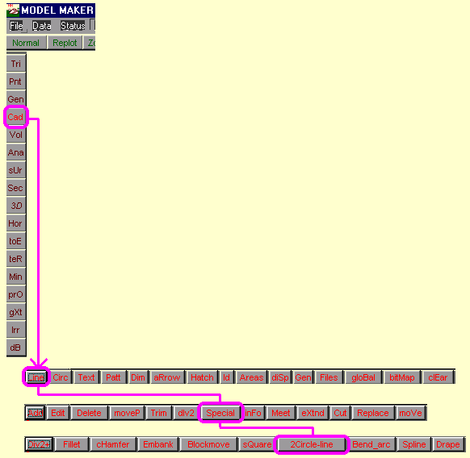

### [popup vol damvol](./popup_vol_damvol.htm)

### [popup vol sec](./popup_vol_sec.htm)

### [popup vol tri](./popup_vol_tri.htm)

### [POWER LINE DESIGN](./powerlinedesign.htm)

### [POWER LINES : Conductors](./powerlinesconductors.htm)

### [POWER LINES : Defaults](./powerlinesdefaults.htm)

### [POWER LINES : Pole Data](./powerlinespoledata.htm)

### [POWER LINES : Pole Info](./powerlinespoleinfo.htm)

### [POWER LINES : Short List](./powerlinesshortlist.htm)

### [POWER LINES : Spanning Sheets](./powerlinesspanningsheets.htm)

### [POWER LINES : Vertical Design](./powerlinesverticaldesign.htm)

### [Program folder](./programfolder.htm)

### [PROJECTS : Active project](./projectsactiveproject.htm)

### [PROJECTS : Delete](./projectsdelete.htm)

### [PROJECTS : Remove redundant data](./projectsremoveredundantda.htm)

### [PROJECTS : Selecting the active pro](./projectsselectingtheactiv.htm)

### [PROJECTS : Use of projects](./projectsuseofprojects.htm)

### [PROJECTS : Copy between projects](./projects___copy_data_between_p.htm)

### [Project Notes](./project_notes.htm)

### [PROJECTS : Compare data](./project___compare_data_.htm)

### [PROJECTS : Compare slopes](./project___compare_slopes.htm)

### [Sort coordinates](./project___sort_data_.htm)

### [Purpose of function](./purposeoffunction.htm)

### [Quick Start](./quick_start.htm)

### [Roadmap](./roadmap.htm)

### [FILE : Save/Total](./savetotal.htm)

### [SCALE : Plotting](./scaleplotting.htm)

### [SCALE : Text update](./scaletextupdate.htm)

### [Secondary losses through Valve](./secondary_losses_through_valve.htm)

### [Cross - sections](./section___extract.htm)

### [Import](./section___import_.htm)

### [SECTION : Sections to DTM](./section___moss_to_dtm.htm)

### [SETTINGS : Colors](./settingscolors.htm)

### [SETTINGS : Language](./settingslanguage.htm)

### [SETTINGS : Line & text info](./settingslinetextinfo.htm)

### [Output Device](./settings_outputdevice.htm)

### [SETTINGS : File Units](./settings__file_units.htm)

### [SETTINGS](./settings___colors.htm)

### [SETTINGS : Colors - Cad](./settings___colors_cad.htm)

### [SETTINGS : Defaults](./settings___defaults.htm)

### [SETTINGS : Speed menu](./settings___speed_menu.htm)

### [SETUP : Security key](./setupsecuritykey.htm)

### [SETTINGS : Configuration](./setup___configuration.htm)

### [SHORTCUT KEYS](./shortcutkeys.htm)

### [Welcome](./start_up.htm)

### [STATION CONFIGURATION](./stationconfiguration.htm)

### [STATUS](./status.htm)

### [STATUS - Cad stings](./status_cadstings.htm)

### [STRING : Add](./stringadd.htm)

### [STRING : Add - Alignment](./stringadd_alignment.htm)

### [STRING : Add - Copy](./stringadd_copy.htm)

### [STRING : Add - Fillet](./stringadd_fillet.htm)

### [STRING : Add - Grade](./stringadd_grade.htm)

### [STRING : Add - Node+](./stringadd_node.htm)

### [STRING : Add - Parallel](./stringadd_parallel.htm)

### [STRING : Add - Toeline](./stringadd_toeline.htm)

### [STRING : Vert - Constant](./stringconstant.htm)

### [STRING : Utility - Copy to CAD](./stringcopytocad.htm)

### [STRING : Utility - Copy to Horizontal](./stringcopytohorizontal.htm)

### [STRING : Info - Display](./stringdisplay.htm)

### [STRING : Utility - Drape onto DTM](./stringdrapeontodtm.htm)

### [STRING : Utility - DTM on Nodes](./stringdtmonnodes.htm)

### [STRING : Editor](./stringeditor.htm)

### [STRING : Vert - Edit Z](./stringeditz.htm)

### [STRING : Vert - Grade Node](./stringgradenode.htm)

### [STRING : Utility - Horizontal to String](./stringhorizontaltostring.htm)

### [STRING : Identify](./stringidentify.htm)

### [STRING : Identify - Area](./stringidentify_area.htm)

### [STRING : Id - Manid - Delete](./stringidentify_delete.htm)

### [STRING : Id - Manid - Grade](./stringidentify_manidgra.htm)

### [STRING : Id - Manid - Clash](./stringidentify_manid_cl.htm)

### [STRING : Id - Manid - Combine](./stringidentify_manid_co.htm)

### [STRING : Id - Manid - Move](./stringidentify_move.htm)

### [STRING : Identify - New](./stringidentify_new.htm)

### [STRING : Identify - Show](./stringidentify_show.htm)

### [STRING : Id - Manid - Longsection](./stringid_manid_longsect.htm)

### [STRING : Id - Manid - PID](./stringid_manid_pid.htm)

### [STRING : Id - Manid - Services](./stringid_manid_services.htm)

### [STRING : Identity - Single](./stringid_single.htm)

### [STRING : Info - Area 2](./stringinfo_area2.htm)

### [STRING : Info - Names](./stringinfo_names.htm)

### [STRING : Introduction](./stringintroduction.htm)

### [STRING : Manipulate Identify](./stringmanipulateidentify.htm)

### [STRINGS](./strings__gxt_.htm)

### [MENU : Gxt](./strings__gxt__2.htm)

### [STRING : Utility - Quick dam - Tutorial](./stringutility_quickdam.htm)

### [STRING : Utility - String - DTM](./stringutility_string_dt.htm)

### [STRING : Utility - Update dtm](./stringutility_updatedtm.htm)

### [STRING : Vert - 3D](./stringvert_3d.htm)

### [STRING : Vert - Copy cad](./stringvert_copycad.htm)

### [STRING : Vert - Node add](./stringvert_nodeadd.htm)

### [STRING : Vert - Node delete](./stringvert_nodedelete.htm)

### [STRING : Vert - Node move](./stringvert_nodemove.htm)

### [STRING : Vert - Label](./string_label.htm)

### [STRING : Vert - Name](./string_name.htm)

### [STRING : Vert - Relative grade](./string_relative_grade.htm)

### [STRING : Utility - Services](./string_services.htm)

### [STRING : Utility](./string_utility.htm)

### [STRING : Utility - Embankment](./string_utility_embankment.htm)

### [STRING : Utility - Load Ascii](./string_utility_load_ascii.htm)

### [STRING : Utility - Quick dam](./string_utility_quick_dam.htm)

### [STRING : Utility - String Long Section](./string__utility___string_long_.htm)

### [String : Utility - Record Longsection To](./string__utility____record_long.htm)
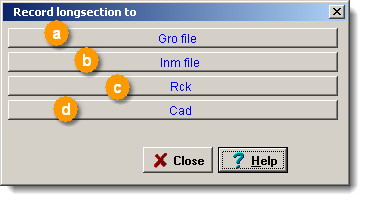

### [String : Utility - To Cad - Profile format](./string__utility____to_cad___pr.htm)

### [STRING : Clear](./string___clear.htm)

### [STRING : Delete](./string___delete.htm)

### [STRING : Edit](./string___edit___flip.htm)

### [STRING : Files](./string___files.htm)

### [STRING : Info](./string___info.htm)

### [STRING : Vert](./string___vert.htm)

### [SURVEY : Geo Grid](./surveygeogrid.htm)

### [SURVEY : Helmert](./surveyhelmert.htm)

### [SURVEY : Polar input](./surveypolarinput.htm)

### [SURVEY : Area](./survey___area_.htm)

### [SURVEY : Area of triangles](./survey___area_of_triangles.htm)

### [SURVEY : Convert LO](./survey___convert_lo.htm)
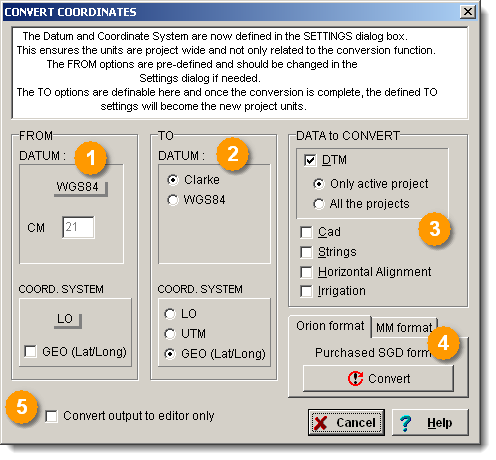

### [SURVEY : Direct survey](./survey___direct_survey.htm)

### [SURVEY : Fitline](./survey___fitline.htm)

### [SURVEY : Intersection](./survey___intersection_.htm)

### [SURVEY : Join](./survey___join_.htm)

### [SURVEY : Line area](./survey___line_area.htm)

### [SURVEY : Polar](./survey___polar_.htm)

### [SURVEY : Traverse](./survey___traverse.htm)

### [SURVEY : Traverse - Radial](./survey___traverse___radial.htm)

### [TERRACE](./terrace.htm)

### [TERRACE : Cross-sections](./terracecross_sections.htm)

### [TERRACE : Hatch cut-fill](./terracehatchcut_fill.htm)

### [TERRACE : Parameters](./terraceparameters.htm)

### [TERRACE : Volumes - Cut & Fill - Depth](./terracevolumes_cutfill.htm)

### [TERRACE : Volumes - Cut & Fill - Compactions](./terracevolumes_cutfill2.htm)

### [TERRACE : Optimize](./terrace__optimize.htm)

### [TERRACE : Autostring](./terrace___autostring.htm)

### [TERRACE : Volumes - Cut & Fill - Methods](./terrace___volumes___cut___fill.htm)

### [CAD : Text - Attributes](./textattributes.htm)

### [TOEPOINT](./toepoint.htm)

### [TOEPOINT : Point](./toepoint___point_.htm)

### [TOEPOINT : Slope parameters](./toepoint___slope_parameters_.htm)

### [TOEPOINT : Add](./toepoint____add.htm)

### [UTILITY](./topmenu2.htm)

### [TRACKING : Menu](./trackingmenu.htm)

### [Add - Manually](./trianglecreating_manually.htm)

### [TRIANGLE : Detail](./triangledetail.htm)

### [TRIANGLE : Edit](./triangleedit(1).htm)

### [TRIANGLE : Edit example](./triangleedit(2).htm)

### [TRIANGLE : Edit - After model](./triangleedit_aftermodel.htm)

### [TRIANGLE : Edit - Automatic](./triangleedit_automatic.htm)

### [TRIANGLE : Edit - Before model](./triangleedit_beforemodel.htm)

### [TRIANGLE : Edit - Summary](./triangleedit_summary.htm)

### [TRIANGLE : Modeling data](./trianglemodelingdata.htm)

### [TRIANGLE : Normal search method](./trianglenormalsearchmetho.htm)

### [TRIANGLE : Quick Search](./trianglequicksearch.htm)

### [TRIANGLE : Save](./trianglesave.htm)

### [TRIANGLE : Add](./triangle___add.htm)

### [TRIANGLE : Constant](./triangle___add_constant.htm)

### [TRIANGLE : Clear](./triangle___clear.htm)

### [Ceate - Automatically](./triangle___creating___automati.htm)

### [TRIANGLE : Cross-section](./triangle___cross_section.htm)

### [TRIANGLE : Csearch](./triangle___csearch.htm)
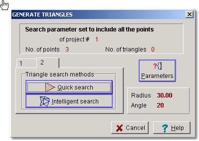

### [Deleting triangles](./triangle___delete.htm)

### [TRIANGLE : Display](./triangle___display.htm)

### [TRIANGLE : Edit manually](./triangle___edit___example.htm)

### [TRIANGLE : Errors](./triangle___errors.htm)

### [TRIANGLE : Parameters](./triangle___parameters.htm)

### [TRIANGLE : Search - Normal](./triangle___search___normal.htm)

### [TRIANGLE : Side](./triangle___side_.htm)

### [TRIANGLE : Sort](./triangle___special.htm)

### [TRIANGLE : Wipeout](./triangle___wipeout.htm)

### [Trouble : Adding cad lines](./troubleaddingcadlines.htm)

### [Trouble : Contours](./troublecontours.htm)

### [Trouble : Digitizing](./troubledigitizing.htm)

### [Trouble : Finding files](./troublefindingfiles.htm)

### [Trouble : Images](./troubleimages.htm)

### [Trouble : Knowing the layer](./troubleknowingthelayer.htm)

### [Trouble : Plotting & Scale](./troubleplottingscale.htm)

### [Booker format](./ubookerformat.htm)

### [Example of a typical REC module data file](./uexampleofatypicalrecmodul.htm)

### [Example of Geodimeter fieldbook data](./uexampleofgeodimeterfieldboo.htm)

### [Example of Logger data](./uexampleofloggerdata.htm)

### [Example of Qess data format](./uexampleofqessdataformat.htm)

### [Example of Scanner data](./uexampleofscannerdata.htm)

### [Example of the GRM format](./uexampleofthegrmformat.htm)

### [Example of the Organisur format](./uexampleoftheorganisurforma.htm)

### [Example of Topcon data](./uexampleoftopcondata.htm)

### [Example of typical GSI data file:](./uexampleoftypicalgsidata.htm)

### [Example of YOM data:](./uexampleofyomdata.htm)

### [FRT format](./ufrtformat.htm)

### [Main item codes.](./umainitemcodes_.htm)

### [SDR data formats](./usdrdataformats.htm)

### [USERS](./users.htm)

### [UTILITY : ASCII - READ SEQUENTIAL](./utilityascii_readsequent.htm)

### [UTILITY : Comms](./utilitycomms.htm)

### [UTILITY : Download data](./utilitydownloaddata.htm)

### [UTILITY : Electronic2](./utilityelectronic2.htm)

### [UTILITY : Electronic data ex1](./utilityelectronicdataex1.htm)

### [UTILITY : Electronic data par-def](./utilityelectronicdatapar_.htm)

### [UTILITY : Trig data](./utilitytrigdata.htm)

### [UTILITY : ASCII File](./utility___ascii_file_.htm)

### [UTILITY : Bitmap to clipboard](./utility___bitmap_to_clipborad.htm)

### [UTILITY : Digitize](./utility___digitize.htm)

### [UTILITY : Electronic data](./utility___electronic_data.htm)

### [VOLUME : Average](./volumeaverage.htm)

### [VOLUME : Grid](./volume__grid.htm)

### [VOLUME : Area of contour](./volume___area_of_contour.htm)

### [VOLUME : Contours](./volume___contours_.htm)

### [VOLUME : Dam volume](./volume___dam_volume.htm)

### [VOLUME : Sections](./volume___sections.htm)

### [VOLUME : Triangles](./volume___triangles.htm)

### [What's new in Model Maker](./whatsnewinmodelmaker.htm)

### [Working examples](./workingexamples.htm)

### [ZOOM](./zoom.htm)

### [3D : Quick view](./_d___quick.htm)

### [3D : View](./_d___view_.htm)

### [?Set3](./_set3.htm)
